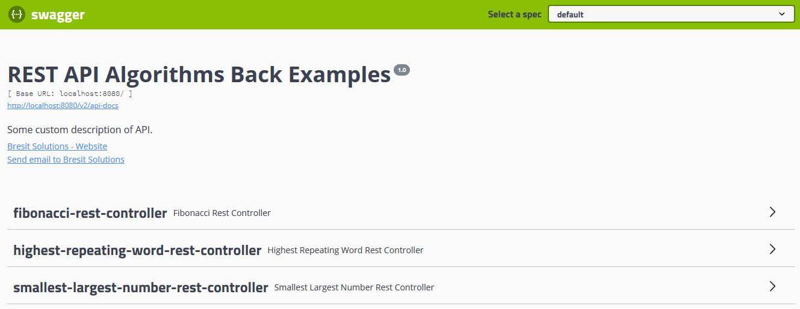

= REST API Algorithms Back Examples
:page-layout: base
:source-language: java
:icons: font
:linkattrs:
:sectanchors:
:sectlink:
:numbered:
:doctype: book
:toc: preamble
:tip-caption: :bulb:
:note-caption: :information_source:
:important-caption: :heavy_exclamation_mark:
:caution-caption: :fire:
:warning-caption: :warning:

Implementation of some popular algorithms.

== Algorithms

=== Fibonacci

Print Fibonacci series up to a given number with and without memoization techniques.

=== Highest repeating word

Find highest repeating word from a text file.

=== Smallest and largest number

Find smallest and largest number in an integer array.

== Running locally

You can run this application in a terminal through the following command:

----
mvn spring-boot:run
----

or directly in your favorite IDE. After the application will be running, you can access it through the url `http://localhost:8080/swagger-ui.html`.

== Documentation

The Rest API was documented using Swagger.
